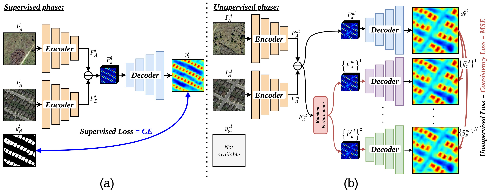

## SS-CD: Semi-Supervised Change Detection in Remote Sensing Images via Consistency Regularization

#### [Paper]()

This repocitory contains the official implementation of our paper:  Revisiting Consistency Regularization for Semi-supervised Change Detection in Remote Sensing Images.

<p align="center"></p>

### Requirements

This repo was tested with `Ubuntu 18.04.3 LTS`, `Python 3.7`, `PyTorch 1.1.0`, and `CUDA 10.0`. But it should be runnable with recent PyTorch versions >=1.1.0.

The required packages are `pytorch` and `torchvision`, together with `PIL` and `opencv` for data-preprocessing and `tqdm` for showing the training progress.

```bash
pip install -r requirements.txt
```

### Datasets
We use two publicly available, widely-used CD datasets for our experiments, namely LEVIR-CD and WHU-CD. The LEVIR-CD and WHU-CD are building CD datasets.

The processed LEVIR-CD dataset and supervised-unsupervised splits can be downloaded [here](https://www.dropbox.com/sh/qxp2t98qpesouiy/AAD1Xr7-XPajzvyQfzPA1LKAa?dl=0)

The processed WHU-CD dataset and supervised-unsupervised splits can be downloaded [here](https://www.dropbox.com/sh/5qdnav1w7pmd74t/AABx_mLdj1MHj1SP2Djxgdf1a?dl=0)

### Training

To train a model, first download te daaasets detailed above and proces  to crate different splits, then set `data_dir` to the dataset path in the config file in `configs/config.json` and set the rest of the parameters, like the number of GPUs, cope size, data augmentation ... etc ,you can also change if you wish, more details below. 

#### Training on LEVIR-CD dataset
Then simply run:
```bash
python train.py --config configs/config_LEVIR.json
```

| Setting | Required settings in config file |
| --- | --- |
| Supervised - 5% labeled data | Experiment name: `SemiCD_(semi)_5`, sup_percent= '5', model.supervised=`True`, model.semi=`False` |
| Supervised - 10% labeled data | Experiment name: `SemiCD_(semi)_10`, sup_percent= '5', model.supervised=`True`, model.semi=`False` |
| Supervised - 20% labeled data | Experiment name: `SemiCD_(semi)_20`, sup_percent= '5', model.supervised=`True`, model.semi=`False` |
| Supervised - 40% labeled data | Experiment name: `SemiCD_(semi)_40`, sup_percent= '5', model.supervised=`True`, model.semi=`False` |
| Supervised - 100% labeled data | Experiment name: `SemiCD_(semi)_100`, sup_percent= '5', model.supervised=`True`, model.semi=`False` |
| `git diff` | Show file differences that **haven't been** staged |


The log files and the `.pth` checkpoints will be saved in `saved\EXP_NAME`, to monitor the training using tensorboard, please run:

```bash
tensorboard --logdir saved
```

To resume training using a saved `.pth` model:

```bash
python train.py --config configs/config_LEVIR.json --resume saved/SemiCD/checkpoint.pth
```

**Results**: The results will be saved in `saved` as an html file, containing the validation results,
and the name it will take is `experim_name` specified in `configs/config_LEVIR.json`.

### Inference

For inference, we need a pretrained model, the pre-chage and pos-change imags that we wouldlike to dtet changes and the config used in training (to load the correct model and other parameters), 

```bash
python inference.py --config config_LEVIR.json --model best_model.pth --images images_folder
```

Here are the flags available for inference:

```
--images       Folder containing the jpg images to segment.
--model        Path to the trained pth model.
--config       The config file used for training the model.
```

### Pre-trained models

Pre-trained models can be downloaded [here]().

### Citation

If you find this repo useful for your research, please consider citing the paper as follows:

```

```

#### Acknowledgements

- This code is based on [CCT](https://github.com/yassouali/CCT).
- Code structure was based on [Pytorch-Template](https://github.com/victoresque/pytorch-template/blob/master/README.m)
- ResNet backbone was downloaded from [torchcv](https://github.com/donnyyou/torchcv)